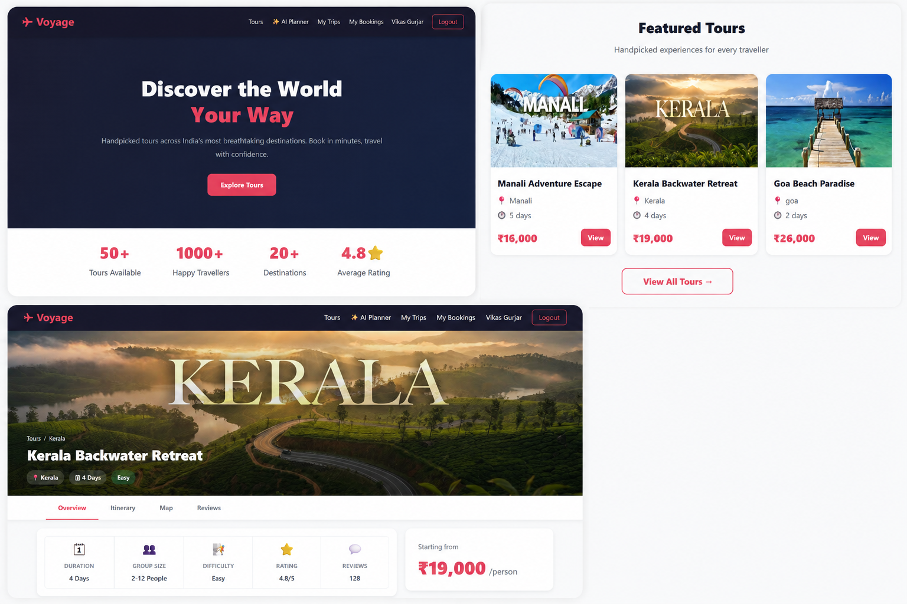

# VoyageAI - Intelligent Travel & Tour Management Platform

A comprehensive, full-stack web application designed to simplify and enhance the travel planning experience. VoyageAI combines traditional tour booking with advanced AI-driven itinerary generation, providing users with personalized travel schedules, seamless booking management, and expense tracking.

**Live Application:** [https://voyage-ai-mern.vercel.app](https://voyage-ai-mern.vercel.app)

---

## 📸 Application Screenshot

<!-- Replace the image link below with a screenshot of your application -->
<div align="center">
  
  <p><em>(Add a screenshot of the main dashboard or homepage here)</em></p>
</div>

---

## 🚀 Key Features

VoyageAI provides a wide range of features catering to both everyday travelers and application administrators:

### For Users (Travelers)
- **AI-Powered Itineraries:** Generate custom day-by-day travel itineraries based on destination, preferences, and duration using advanced AI models (Anthropic Claude/Google Gemini).
- **Tour Booking System:** Browse, search, and book curated tours effortlessly.
- **Interactive Maps:** View destinations, nearby attractions, and tour routes via integrated interactive maps.
- **Expense Tracking:** Manage travel budgets by keeping track of personal expenses directly within the app.
- **Secure Authentication:** User registration, login, and secure sessions using JWT.
- **Reviews & Ratings:** Leave reviews and ratings for completed tours to help other travelers.
- **Seamless Payments:** Integrated secure checkout process for booking tours.
- **PDF & CSV Exports:** Download itineraries, booking invoices, and expense reports in PDF or CSV formats.

### For Administrators
- **Tour Management:** Create, update, and delete tours, managing images via Cloudinary.
- **Booking Oversight:** Monitor user bookings and manage platform activity.
- **Interactive Dashboards:** Visual analytics using interactive charts.

---

## 💻 Technology Stack

This project is built using the **MERN** stack along with a modern ecosystem of libraries and services.

### Frontend
- **Framework:** React.js (Vite)
- **State Management:** Redux Toolkit (RTK)
- **Styling:** Tailwind CSS, Framer Motion (for animations)
- **Routing:** React Router DOM
- **Maps:** React Leaflet
- **Data Visualization:** Recharts
- **HTTP Client:** Axios

### Backend
- **Runtime:** Node.js
- **Framework:** Express.js
- **Database:** MySQL (Sequelize ORM) / MongoDB (Mongoose)
- **Authentication:** JSON Web Tokens (JWT), bcrypt.js
- **AI Integration:** Anthropic AI SDK, Google GenAI
- **File Storage:** Cloudinary, Multer
- **Payment Gateway:** Razorpay
- **Utilities:** Nodemailer (Emails), PDFKit, json2csv

---

## 🛠️ Getting Started

Follow these instructions to set up the project locally on your machine.

### Prerequisites
Make sure you have the following installed:
- [Node.js](https://nodejs.org/) (v16 or higher)
- MySQL / MongoDB server (depending on the environment configuration)
- Git

### 1. Clone the Repository

```bash
git clone https://github.com/your-username/voyage-ai-mern.git
cd voyage-ai-mern
```

### 2. Backend Setup

Open a terminal and navigate to the backend directory:

```bash
cd Backend
npm install
```

**Environment Variables:**
Create a `.env` file in the `Backend` directory and configure the following variables:

```env
PORT=5000
DB_HOST=your_database_host
DB_USER=your_database_user
DB_PASS=your_database_password
DB_NAME=voyage_db
JWT_SECRET=your_jwt_secret_key
CLOUDINARY_CLOUD_NAME=your_cloudinary_name
CLOUDINARY_API_KEY=your_cloudinary_key
CLOUDINARY_API_SECRET=your_cloudinary_secret
ANTHROPIC_API_KEY=your_anthropic_api_key
RAZORPAY_KEY_ID=your_razorpay_key
RAZORPAY_KEY_SECRET=your_razorpay_secret
```

Start the backend server:

```bash
npm run dev
```

### 3. Frontend Setup

Open a new terminal and navigate to the frontend directory:

```bash
cd Frontend
npm install
```

**Environment Variables:**
Create a `.env.local` or `.env` file in the `Frontend` directory:

```env
VITE_API_BASE_URL=http://localhost:5000/api
```

Start the frontend development server:

```bash
npm run dev
```

The application should now be running! Open your browser and visit `http://localhost:5173`.

---

## 📂 Project Structure

```text
voyage-ai-mern/
├── Backend/                 # Server-side application
│   ├── config/              # Database and third-party service configurations
│   ├── controllers/         # Request handling logic
│   ├── models/              # Database schemas
│   ├── routes/              # API endpoints definitions
│   ├── middlewares/         # Custom Express middlewares (auth, upload)
│   └── server.js            # Entry point of the backend application
│
├── Frontend/                # Client-side application
│   ├── src/
│   │   ├── components/      # Reusable React components
│   │   ├── pages/           # Application views/pages
│   │   ├── store/           # Redux store and slices
│   │   ├── utils/           # Helper functions
│   │   └── App.jsx          # Main React component
│   └── index.html           # HTML template
│
└── README.md                # Project documentation
```

---

## 🤝 Contributing

Contributions, issues, and feature requests are welcome!
Feel free to check out the issues page if you want to contribute.

1. Fork the Project
2. Create your Feature Branch (`git checkout -b feature/AmazingFeature`)
3. Commit your Changes (`git commit -m 'Add some AmazingFeature'`)
4. Push to the Branch (`git push origin feature/AmazingFeature`)
5. Open a Pull Request

---

## 📝 License

This project is open-source and available under the [ISC License](LICENSE).
