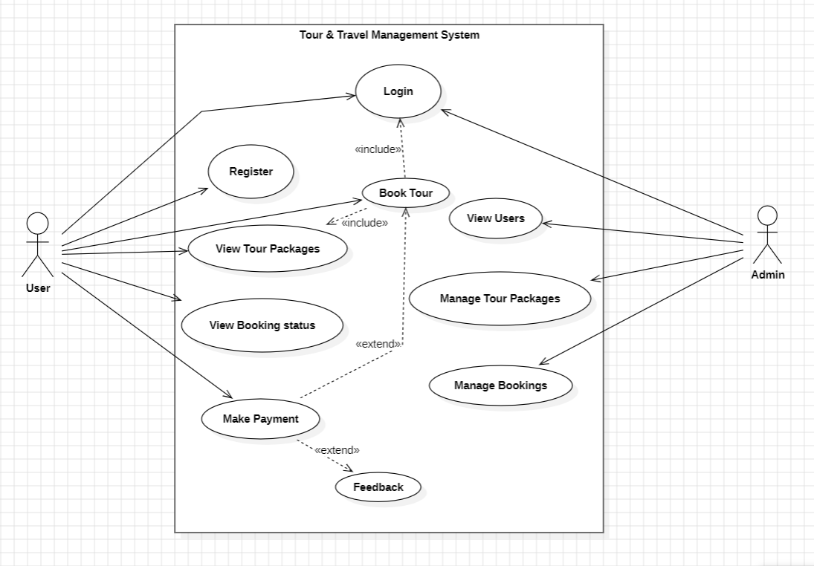

# 📊 Use Case Diagram  
## Tour & Travel Management System

This document presents the **Use Case Diagram** for the Tour & Travel Management System.  
The diagram visually represents interactions between system actors and core functionalities.

---

## 🖼️ Use Case Diagram

---

## 1. System Boundary

The system boundary covers all functionalities related to:
- Tour browsing
- Booking and payment
- Administrative management

---

## 2. Actors

### User
- Registers and logs into the system
- Views tour packages
- Books tours
- Makes payments
- Views booking status

### Admin
- Logs into the system
- Manages tour packages
- Manages bookings
- Views registered users

---

## 3. Use Case Relationships

- **Book Tour** includes **View Tour Packages**
- **Book Tour** includes **Make Payment**
- **Book Tour** includes **View Booking Status**

---

## 4. Design Notes

- The diagram is derived from approved project requirements.
- Responsibilities of User and Admin are clearly separated.
- Advanced features not part of the first version are excluded.

---

## 📄 End of Use Case Diagram Documentation
